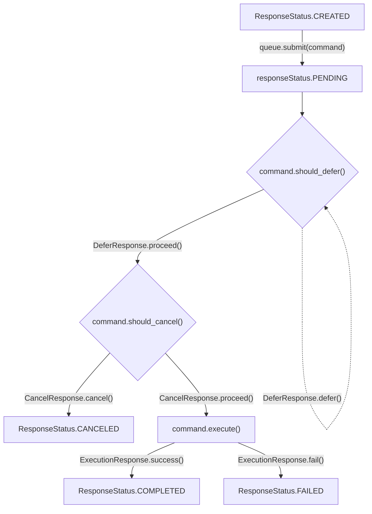

## Command Lifecycle

```mermaid
flowchart TD
    A[ResponseStatus.CREATED] -->|"queue.submit(command)"| B[responseStatus.PENDING]
    B --> C{"command.should_defer()"}
    C -.->|"DeferResponse.defer()"| C
    C -->|"DeferResponse.proceed()"| D{"command.should_cancel()"}
    D -->|"CancelResponse.cancel()"| E[ResponseStatus.CANCELED]
    D -->|"CancelResponse.proceed()"| F["command.execute()"]
    F -->|"ExecutionResponse.success()"| G["ResponseStatus.COMPLETED"]
    F -->|"ExecutionResponse.fail()"| H["ResponseStatus.FAILED"]
```