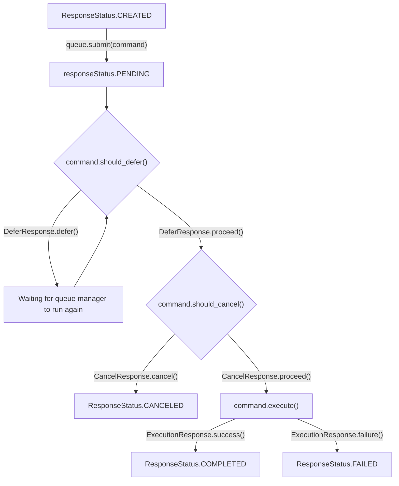

## Command Lifecycle



## Creating a command
Subclass `CommandArgs` and add any arguments your command needs. This class will be used to pass parameters to your command.

> [!CAUTION]
> Don't add your arguments directly to the `Command` class. The args class is required for command chaining to work in a type-safe manner.

Subclass `Command` and set the `ARGS` class attribute to the subclass of `CommandArgs` you created. Implement the `execute` method to define the command's behavior.
- You can also override `should_defer` and `should_cancel` methods to control the command's lifecycle.

Optionally, you can create a custom response class by subclassing `Response` so that your command can return specific type-safe data. If you do this, set the `_response_type` class attribute of your `Command` subclass to your custom response class.

### Writing your `execute` method
> [!WARNING]  
> Your `execute` method should not return your custom response class directly. 
> The `self.response` attribute is automatically set to an instance of your custom response class, which you should *modify* instead. Then, return an `ExecutionResponse` instance to indicate the command's success or failure. 

```python
from command_pattern import (
    Command,
    CommandArgs,
    Response,
    ExecutionResponse,
    CommandQueue,
    ResponseStatus,
)
from dataclasses import dataclass
from typing import Optional


@dataclass
class SayHelloArgs(CommandArgs):
    name: Optional[str]


@dataclass
class SayHelloResponse(Response):
    message: str = ""


class SayHelloCommand(Command[SayHelloArgs, SayHelloResponse]):
    ARGS = SayHelloArgs
    _response_type = SayHelloResponse

    def execute(self) -> ExecutionResponse:
        if self.args.name is None:
            return ExecutionResponse.failure("Cannot say hello to no one.")
        self.response.message = f"Hello, {self.args.name}!"
        return ExecutionResponse.success()
```
    